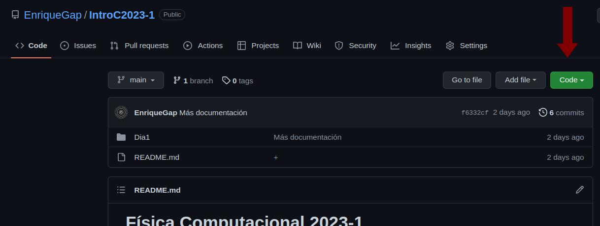
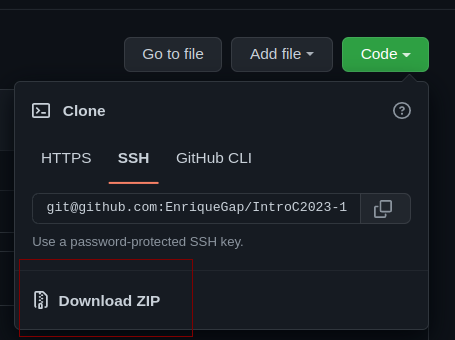

# Física Computacional 2023-1

Hola!. En este repositiorio encontrarás las notas y códigos que se mostrarán a lo largo de las clases y con los que aprenderemos a programar en C.

Tú puedes descargar este repositorio, siguiendo estas instrucciones:

Primero, ubica el botón en la parte superior derecha que dice **"Code"**:

Da click en el botón y se desplegará un menú de opciones donde podrás descarga un zip con todo el contenido de este repositorio.

Este es el temario y la planeación de los siguientes dos días.

## [Introducción a C](./Dia1/README.md)

- Diferencias entre C y Python
- ¿Cómo y dónde programar en C?
- Compilación y ejecución
- Hello World! programar en C
	- Declaración de variables
	- Estructuras de control
	- Las librerías stdio.h y math.h
- Errores de compilación vs Errores de ejecución
- Header

## [Temas Avanzados en C](./Dia2/README.md)

- Lectura y escritera de ficheros
- Funciones
- Métodos Runge Kutta
- Variables globales y locales
- Makefiles
<!---
- Punteros
--->

## Bibliografía

- Oualline, S., __Practical C Programming__
- Kernighan, B.W. & Ritchie, D.M. __The C programming Language__
- Press, W.H., Teukolsky, S.A., et al __Numerical Recipes in C__
- YouTube [__Empieza A Programar__](https://www.youtube.com/playlist?list=PLw8RQJQ8K1ySN6bVHYEpDoh-CKVkL_uOF)
